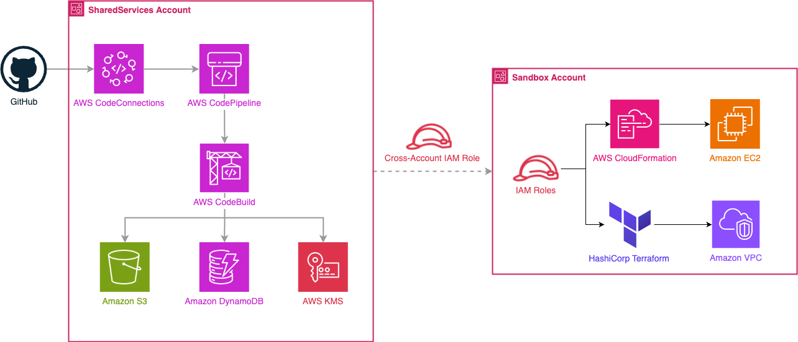

# Building CI/CD Pipelines with Landing Zone Accelerator on AWS: Terraform and CloudFormation Automation

Suitable for organizations seeking to automate infrastructure deployment and governance across complex multi-account AWS environments.

---

> **⚠️ Important:** This sample code is provided for demonstration and educational purposes only. It should be thoroughly reviewed, tested, and customized to meet your organization's specific requirements before deploying to production environments. Always follow your organization's security policies and AWS best practices.

---

## Table of Contents

- [Overview](#overview)
- [Architecture](#architecture)
- [Prerequisites](#prerequisites)
- [Quick Start](#quick-start)
- [Deployment Guide](#deployment-guide)
- [Configuration](#configuration)
- [Testing](#testing)
- [Troubleshooting](#troubleshooting)
- [Cleanup](#cleanup)
- [Security](#security)
- [Cost Estimates](#cost-estimates)
- [Contributing](#contributing)
- [License](#license)
- [Getting Help](#getting-help)
- [Resources](#resources)

---

## Overview

### What This Does

Extends **Landing Zone Accelerator on AWS (LZA)** with custom CI/CD pipelines for deploying infrastructure across multiple AWS accounts using both **Terraform** and **CloudFormation**.

```
GitHub → CodePipeline → CodeBuild → Cross-Account Deployment → Target Account
```

### Key Components

- **Landing Zone Accelerator on AWS** - Multi-account AWS environment foundation
- **AWS CodePipeline** - Orchestrates CI/CD workflows
- **AWS CodeBuild** - Executes validation and deployment
- **GitHub CodeStar Connection** - Source code integration
- **Cross-Account IAM Roles** - Secure multi-account deployments
- **Terraform & CloudFormation** - Infrastructure as Code tools
- **S3 + KMS** - Encrypted artifact storage
- **DynamoDB** - Terraform state locking

### Deployment Flow

1. Developer pushes code to GitHub → CodePipeline detects changes
2. CodeBuild validates templates (cfn-lint, cfn-nag, tflint, tfsec)
3. Manual approval gate for production changes
4. Cross-account deployment to target account
5. Infrastructure deployed via CloudFormation or Terraform

---

## Architecture



### Multi-Account Structure

**5 AWS Accounts across 3 Organizational Units:**
- **Management** (Root OU) - LZA control plane
- **LogArchive** (Security OU) - Centralized logging
- **Audit** (Security OU) - Security auditing
- **SharedServices** (Infrastructure OU) - CI/CD Hub
- **Sandbox** (Sandbox OU) - Deployment target

---

## Prerequisites

### Required Software
- **AWS CLI** v2.x configured with appropriate permissions ([Setup Guide](https://docs.aws.amazon.com/cli/latest/userguide/getting-started-install.html))
- **Git** for version control
- **Terraform** >= 1.6.0 (for Terraform deployments)
- **Python** >= 3.11 (for validation tools)
- **Ruby** >= 3.2 (for cfn-nag)

### Landing Zone Accelerator on AWS
- **LZA Deployed** - Version 4.0 or later
- **Control Tower Enabled** - With Landing Zone v4.0
- **Organizational Units** - Root, Security, Infrastructure, Sandbox

### AWS Permissions Required
Your AWS credentials need the following permissions:
- AWS Organizations (read access)
- CloudFormation (full access)
- CodePipeline (full access)
- CodeBuild (full access)
- IAM (create/manage roles and policies)
- S3 (create/manage buckets)
- KMS (create/manage keys)
- Systems Manager Parameter Store (read/write)

### GitHub Repository
- GitHub account with repository access
- Repository containing infrastructure code
- Branch: `main` (or configure your preferred branch)

---

## Quick Start

### 1. Clone the Repository

```bash
git clone https://github.com/aws-samples/sample-aws-lza-cicd-customizations.git
cd sample-aws-lza-cicd-customizations
```

### 2. Configure LZA

Update your LZA configuration repository with the provided files:

```bash
# Copy LZA configuration files
cp config/*.yaml ~/aws-accelerator-config/

# Copy IAM policies
cp iam-policies/*.json ~/aws-accelerator-config/iam-policies/

# Copy customizations
cp customizations/*.yaml ~/aws-accelerator-config/customizations/
```

### 3. Update Configuration

Edit the configuration files with your account details:

```bash
# Update accounts-config.yaml with your email addresses
vi ~/aws-accelerator-config/accounts-config.yaml

# Update customizations-config.yaml with your GitHub repository
vi ~/aws-accelerator-config/customizations-config.yaml
```

### 4. Deploy LZA Configuration

```bash
cd ~/aws-accelerator-config
git add .
git commit -m "Add CI/CD customizations"
git push origin main
```

### 5. Verify Deployment

After LZA pipeline completes (typically 30-60 minutes):

```bash
# Check CloudFormation stacks in SharedServices account
aws cloudformation list-stacks --stack-status-filter CREATE_COMPLETE

# Verify CodePipeline creation
aws codepipeline list-pipelines

# Check SSM parameters
aws ssm get-parameter --name /cicd/codestar-connection-arn
```

### 6. Activate GitHub Connection

The GitHub CodeStar Connection requires manual activation:

1. Go to **AWS Console** → **Developer Tools** → **Connections**
2. Find your connection: `github-codestar-connection`
3. Click **Update pending connection**
4. Authorize GitHub access
5. Verify status shows **Available**

---

## Deployment Guide

### LZA Configuration Structure

```
aws-accelerator-config/
├── accounts-config.yaml          # AWS account definitions
├── customizations-config.yaml    # CI/CD pipeline stacks
├── global-config.yaml            # Global LZA settings
├── iam-config.yaml               # IAM roles and policies
├── network-config.yaml           # Network configuration
├── organization-config.yaml      # AWS Organizations structure
├── security-config.yaml          # Security controls
├── iam-policies/
│   ├── codebuild-policy.json
│   ├── codepipeline-policy.json
│   ├── terraform-deployment-policy.json
│   ├── cloudformation-deployment-policy.json
│   └── crossaccount-deployment-policy.json
└── customizations/
    ├── base-resources.yaml       # Foundation infrastructure
    ├── cloudformation-pipeline.yaml
    └── terraform-pipeline.yaml
```

### Deployment Stages

#### Stage 1: Foundation Resources (SharedServices)

**Stack**: `CICD-Pipeline-Foundation`

Deploys:
- S3 buckets for artifacts and Terraform states
- KMS key for encryption
- GitHub CodeStar Connection
- DynamoDB table for Terraform state locking
- SSM parameters for cross-stack references

**Deployment Time**: ~5 minutes

#### Stage 2: CloudFormation Pipeline (SharedServices)

**Stack**: `CloudFormation-Workload-Deployment-Pipeline`

Deploys:
- CodePipeline for CloudFormation deployments
- CodeBuild project for validation (cfn-lint, cfn-nag)
- Cross-account deployment configuration

**Deployment Time**: ~3 minutes

#### Stage 3: Terraform Pipeline (SharedServices)

**Stack**: `Terraform-Pipeline`

Deploys:
- CodePipeline for Terraform deployments
- CodeBuild projects for plan and apply
- Validation tools (terraform fmt, validate, tflint, tfsec)

**Deployment Time**: ~3 minutes

---

## Configuration

### Account Configuration

Update `accounts-config.yaml` with your email addresses:

```yaml
workloadAccounts:
  - name: Sandbox
    description: The sandbox account for testing deployments
    email: your-email+sandbox@example.com
    organizationalUnit: Sandbox

  - name: SharedServices
    description: Centralized CI/CD hub
    email: your-email+sharedservices@example.com
    organizationalUnit: Infrastructure
```

### GitHub Repository Configuration

Update `customizations-config.yaml` with your repository details:

```yaml
customizations:
  cloudFormationStacks:
    - name: CloudFormation-Workload-Deployment-Pipeline
      parameters:
        - name: GitHubRepository
          value: "your-org/your-repo"  # Update this
        - name: GitHubBranch
          value: main
```

### IAM Policy Customization

The IAM policies are designed for comprehensive infrastructure management. To restrict permissions, edit the policy JSON files in `iam-policies/`.

---

## Testing

### Unit Testing

Test individual components before deployment:

**1. Validate CloudFormation Templates:**
```bash
# Install validation tools
pip3 install cfn-lint
gem install cfn-nag

# Validate templates
cfn-lint customizations/base-resources.yaml
cfn_nag_scan --input-path customizations/base-resources.yaml
```

**2. Validate Terraform Configuration:**
```bash
# Install validation tools
brew install tflint tfsec  # macOS

# Validate Terraform
cd terraform/
terraform init
terraform fmt -check
terraform validate
tflint
tfsec .
```

**3. Validate IAM Policies:**
```bash
# Use IAM Policy Validator
pip3 install checkov

# Scan policies
checkov -f iam-policies/terraform-deployment-policy.json
```

### Integration Testing

**Test Cross-Account Access:**
```bash
# Assume the Terraform deployment role from SharedServices
aws sts assume-role \
  --role-arn arn:aws:iam::<SANDBOX_ACCOUNT_ID>:role/Terraform-Deployment-Role \
  --role-session-name test-session

# Verify permissions
aws ec2 describe-vpcs
```

---

## Troubleshooting

### Common LZA Issues

**1. LZA Pipeline Fails**
```bash
# Check LZA pipeline status
aws codepipeline get-pipeline-state --name AWSAccelerator-Pipeline

# Check CloudFormation stack events
aws cloudformation describe-stack-events \
  --stack-name AWSAccelerator-CustomizationsStack-<ACCOUNT_ID>-<REGION>
```

**2. GitHub Connection Not Available**
- Go to AWS Console → Developer Tools → Connections
- Find `github-codestar-connection`
- Click "Update pending connection"
- Authorize GitHub access

**3. Cross-Account Role Assumption Fails**
```bash
# Verify role exists in Sandbox account
aws iam get-role --role-name Terraform-Deployment-Role

# Check trust policy
aws iam get-role \
  --role-name Terraform-Deployment-Role \
  --query 'Role.AssumeRolePolicyDocument'
```

### Pipeline Issues

**1. CodeBuild Validation Fails**
```bash
# Check CodeBuild logs
aws logs tail /aws/codebuild/CloudFormation-Validation --follow

# Common issues:
# - cfn-lint errors: Fix template syntax
# - cfn-nag warnings: Address security findings
# - tfsec failures: Fix security issues in Terraform
```

**2. Terraform State Lock Issues**
```bash
# Check DynamoDB table
aws dynamodb scan --table-name terraform-states-lock-<ACCOUNT_ID>

# Force unlock (use with caution)
terraform force-unlock <LOCK_ID>
```

---

## 🗑️ Cleanup

### Quick Cleanup

**⚠️ Warning**: This will delete all deployed infrastructure and pipelines.

```bash
# Remove customizations from LZA config
cd ~/aws-accelerator-config

# Comment out or remove customizations
nano customizations-config.yaml

# Commit and push
git add customizations-config.yaml
git commit -m "Remove CI/CD customizations"
git push origin main
```

### Manual Cleanup (if needed)

```bash
# Delete S3 buckets (must be empty first)
aws s3 rm s3://cicd-artifacts-<ACCOUNT_ID>-<REGION> --recursive
aws s3 rb s3://cicd-artifacts-<ACCOUNT_ID>-<REGION>

# Delete DynamoDB table
aws dynamodb delete-table --table-name terraform-states-lock-<ACCOUNT_ID>

# Delete SSM parameters
aws ssm delete-parameters \
  --names /cicd/codestar-connection-arn \
          /cicd/artifacts-bucket-name \
          /terraform/states-bucket-name
```

---

## Security

### Security Best Practices Implemented

✅ **Encryption:**
- S3 buckets encrypted with KMS
- Terraform state encrypted at rest
- TLS 1.2+ for data in transit

✅ **Access Control:**
- Cross-account IAM roles with trust policies
- Least privilege permissions
- Deny policies for high-risk actions

✅ **Compliance:**
- Regional restrictions
- Tagging for governance (GDPR compliance-scope)
- Audit logging via CloudTrail

✅ **Secrets Management:**
- No hardcoded credentials
- GitHub connection via CodeStar
- KMS-encrypted artifacts

### Production Security Checklist

When moving to production:

- [ ] Review and restrict IAM policies
- [ ] Enable AWS Config for compliance monitoring
- [ ] Configure AWS Security Hub
- [ ] Set up CloudWatch alarms for security events
- [ ] Enable GuardDuty for threat detection
- [ ] Configure VPC Flow Logs analysis
- [ ] Set up automated security scanning
- [ ] Document incident response procedures

---

## Cost Estimates

### Monthly Costs (Small Application)

| Service          | Calculation                              | Monthly Cost |
|:-----------------|:-----------------------------------------|-------------:|
| CodePipeline     | $1 per active pipeline × 2               | $2.00        |
| CodeBuild        | $0.005/min × 100 builds × 5 min          | $2.50        |
| S3 Storage       | $0.023/GB × 10 GB                        | $0.23        |
| DynamoDB         | On-demand (minimal)                      | $0.50        |
| KMS              | $1/month + $0.03/10k requests            | $1.50        |
| CloudWatch Logs  | $0.50/GB × 1 GB                          | $0.50        |
| **Total**        |                                          | **$7-10**   |

**Notes:**
- Costs scale with usage and number of deployments
- Free tier benefits apply for new accounts
- LZA core infrastructure costs not included

---

## Contributing

We welcome contributions! Please read our [Code of Conduct](CODE_OF_CONDUCT.md) and see [CONTRIBUTING](CONTRIBUTING.md) for details on submitting pull requests.

---

## License

This library is licensed under the MIT-0 License. See the [LICENSE](LICENSE) file for details.

---

## Getting Help

For questions or issues:

1. **Check existing issues** - Search [GitHub Issues](https://github.com/aws-samples/sample-aws-lza-cicd-customizations/issues)
2. **Open a new issue** - Provide detailed information about your problem
3. **AWS Support** - For AWS service-specific issues, contact [AWS Support](https://aws.amazon.com/support)

This is a sample solution and is not officially supported by AWS. Use at your own discretion.

---

## Resources

### Landing Zone Accelerator on AWS
- [LZA Developer Guide](https://docs.aws.amazon.com/solutions/latest/landing-zone-accelerator-on-aws/)
- [LZA GitHub Repository](https://github.com/awslabs/landing-zone-accelerator-on-aws)
- [LZA Best Practices](https://docs.aws.amazon.com/prescriptive-guidance/latest/migration-aws-environment/welcome.html)

### AWS Services
- [AWS CodePipeline Documentation](https://docs.aws.amazon.com/codepipeline/)
- [AWS CodeBuild Documentation](https://docs.aws.amazon.com/codebuild/)
- [AWS Organizations Documentation](https://docs.aws.amazon.com/organizations/)
- [AWS IAM Best Practices](https://docs.aws.amazon.com/IAM/latest/UserGuide/best-practices.html)

### Infrastructure as Code
- [Terraform AWS Provider](https://registry.terraform.io/providers/hashicorp/aws/latest/docs)
- [CloudFormation User Guide](https://docs.aws.amazon.com/cloudformation/)
- [Terraform Best Practices](https://www.terraform-best-practices.com/)

### Validation Tools
- [cfn-lint](https://github.com/aws-cloudformation/cfn-lint)
- [cfn-nag](https://github.com/stelligent/cfn_nag)
- [tflint](https://github.com/terraform-linters/tflint)
- [tfsec](https://github.com/aquasecurity/tfsec)

---

**For detailed implementation guide and best practices, refer to the documentation in this repository.**
